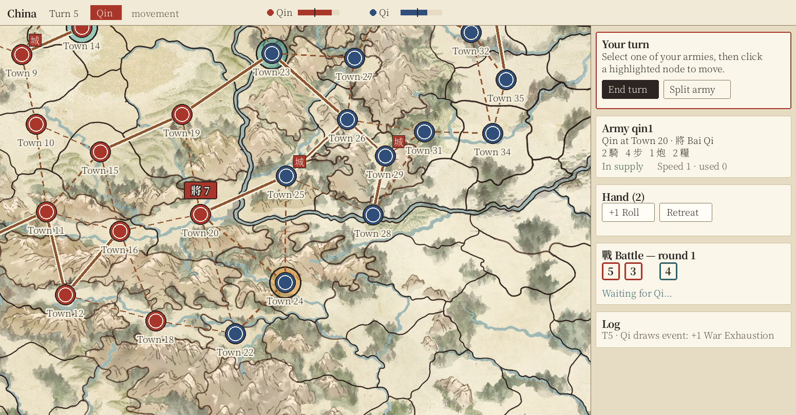

# Krieg Design System: Themeable UI

**Status:** implemented in `packages/client/src/theme` · **Default theme:** Imperial China (`imperial-china`)

**As built:**
- The default themes are `imperial-china` and `prussian-baroque`. Like every theme they are folders in `themes/` (`themes/<id>/theme.json`), which the server lists at `/api/themes`.
- Extra themes can be shared from the server's `themes/` folder.
- A map can name a theme id in `config.json`, or embed a partial theme object there. A theme folder *inside* a map or `.krieg` bundle is not supported yet, and the texture and ornament images aren't shipped.
- The editor has a theme picker with live preview and shows contrast and highlight-vs-nation warnings. The main menu has the player's own theme setting.

See the [README](../Readme.md) for the game rules, map format and how to run the game.

This document describes how Krieg's look can change with the map being played: a Chinese map gets a Chinese imperial interface, a European map can get a completely different style. It covers:

1. [Goals](#1-goals)
2. [How the system works](#2-how-the-system-works)
3. [The theme file](#3-the-theme-file)
4. [Token reference](#4-token-reference)
5. [The canonical theme: Imperial China](#5-the-canonical-theme-imperial-china)
6. [Writing a new theme](#6-writing-a-new-theme)
7. [Implementation plan](#7-implementation-plan)
8. [Open questions](#8-open-questions)

---

## 1. Goals

- **Change the look without changing code.** A theme is a data file (JSON plus optional fonts and images). Loading a different file restyles the menu, lobby, game screen, battle dialog, map overlays and editor.
- **Themes travel with maps.** A map says which theme it uses. When a map is shared as a `.krieg` bundle, or sent from host to peer in an online game, its theme goes with it, so every player sees the same design.
- **Partial themes are fine.** Any token a theme leaves out falls back to the canonical theme. A theme can be as small as five colors and a font.
- **Rules stay readable.** Themes change style, never game information. Nation colors, fog of war, highlight meaning and card effects look different but mean the same thing in every theme.
- **Themes are safe to share.** A theme contains only validated values (colors, lengths, font names, files inside its own bundle). It cannot inject CSS, scripts or remote URLs.

Out of scope for now: sound, animations beyond timings, and translated game text (see [open questions](#8-open-questions)).

---

## 2. How the system works

### 2.1 Pieces

```
Map/China/
  config.json        "theme": "imperial-china"          ← map picks a theme
  map.png
  nodes.png
themes/
  imperial-china/    ← canonical theme (the client also bundles this file as an offline fallback)
    theme.json
    fonts/…woff2
    textures/…png
  prussian-baroque/
    theme.json
```

- **Theme file (`theme.json`):** a set of named design tokens (colors, fonts, sizes, radii, icons, textures). See [section 3](#3-the-theme-file).
- **Canonical theme:** `imperial-china`. The game loads it from `themes/` like any other theme. The client build also includes a copy of the same file, so the game has a complete set of tokens even when the server can't be reached.
- **Theme reference:** an optional `"theme"` field in a map's `config.json`, holding either a theme id or a path to a theme folder inside the map folder.

### 2.2 Resolving which theme to use

When a game, lobby or editor session opens a map, the client resolves its theme in this order:

1. **Player override.** A player can force a theme for themselves, for example for accessibility (high contrast). This is stored per browser and never sent to other players.
2. **Theme inside the map.** A `theme/` folder in the map folder or `.krieg` bundle, if `config.json` points to it.
3. **Named theme.** A theme id resolved from the browser's installed themes, then from the server's `themes/` folder (`GET /api/themes/<id>/theme.json`).
4. **Canonical theme.** `imperial-china`.

The main menu, before any map is chosen, uses the player's last-used theme, or the canonical one.

### 2.3 Merging and applying

```
canonical tokens ──┐
                   ├─ deep merge ─→ resolved tokens ─┬─→ CSS custom properties on <html>  (DOM UI)
theme.json tokens ─┘      │                          └─→ Theme object passed to MapView   (PixiJS canvas)
                          └─ validate (schema + contrast checks) → warnings in the editor
```

1. **Merge.** The resolved tokens are a deep merge of the canonical theme with the map's theme, so missing tokens inherit canonical values. `extends` lets a theme build on another theme instead (for example a dark variant of a light one).
2. **Validate.** A zod schema checks every value type (hex color, length, font stack, asset path inside the bundle). Contrast rules ([section 6.3](#63-contrast-requirements)) produce warnings, not errors. The map editor shows them next to the map's other problems.
3. **Apply to the DOM.** Each token becomes a CSS custom property, such as `--k-color-surface-panel`, set on `document.documentElement`. The stylesheet only ever refers to these variables; no literal colors or fonts remain in it.
4. **Apply to the canvas.** PixiJS cannot read CSS variables efficiently every frame. `MapView` therefore receives a typed `Theme` object when it is created, and re-renders if the theme changes.
5. **Load assets.** Fonts in the bundle are registered with the `FontFace` API from blob URLs. Textures become Pixi textures or CSS `url()` values pointing at blob URLs. Rendering waits for fonts to load, so labels never flash in a fallback font.

Switching theme at runtime (for example in the editor preview) repeats steps 3–5 without reloading the page.

### 2.4 Distribution

| Where the map comes from | How the theme arrives |
|---|---|
| Server `Map/<Name>/` | Theme folder inside the map folder, or a named theme from the server's `themes/` |
| `.krieg` bundle | `theme/` folder inside the zip, added by the editor on Download |
| Online game (peer) | Inside the map bundle the host sends; the theme content is part of the map hash, so a peer never uses a different theme than the host |
| Save game | Same as `.krieg`, since saves bundle their map |

---

## 3. The theme file

### 3.1 Top-level structure

```jsonc
{
  "$schema": "https://krieg.local/schemas/theme-1.json",
  "id": "imperial-china",
  "name": "Imperial China",
  "version": 1,                 // theme format version
  "extends": null,              // optional: id of a theme to inherit from (default: the canonical theme)
  "scheme": "light",            // "dark" | "light", sets the browser color-scheme for native controls
  "assets": {                   // files inside the theme folder, referenced by key elsewhere
    "font-display": "fonts/LXGWWenKai-Regular.woff2",
    "texture-xuan": "textures/xuan-paper.png"
  },
  "fonts": { … },               // see 4.3
  "color": { … },               // see 4.1
  "map": { … },                 // see 4.2
  "type": { … },                // see 4.3
  "shape": { … },               // see 4.4
  "space": { … },               // see 4.5
  "motion": { … },              // see 4.6
  "icons": { … },               // see 4.7
  "ornament": { … }             // see 4.8, optional
}
```

### 3.2 Value types

| Type | Format | Example |
|---|---|---|
| `color` | `#rrggbb` or `#rrggbbaa` | `"#a8362a"` |
| `length` | number of CSS pixels | `6` |
| `duration` | number of milliseconds | `250` |
| `fontStack` | list of family names; bundled families must be declared in `fonts` | `["LXGW WenKai", "Noto Serif SC", "serif"]` |
| `asset` | key in `assets` | `"texture-xuan"` |
| `glyph` | a short language-neutral string, or an icon reference (`"icon:cavalry"`, `"path:M…"`) | `"icon:cavalry"` |
| `easing` | `"linear"` \| `"ease-in"` \| `"ease-out"` \| `"ease-in-out"` \| `"cubic-bezier(a,b,c,d)"` | `"ease-out"` |

Colors are deliberately limited to hex so they work the same in CSS and in PixiJS.

### 3.3 Naming and CSS variables

Token paths map to CSS variables by joining with dashes under a `--k-` prefix:

```
color.surface.panel   →  --k-color-surface-panel
type.size.body        →  --k-type-size-body      (emitted as "14px")
shape.radius.card     →  --k-shape-radius-card
```

Components use **semantic** tokens (`color.action.primary`), never raw palette values. That way, changing the palette doesn't mean hunting for every place a color appears.

---

## 4. Token reference

Every token below is **required in the canonical theme** and **optional in any other theme** (it inherits). The "Replaces" column shows where the current client hard-codes the value, so the implementation work is easy to find.

### 4.1 Interface colors (`color.*`)

| Token | Used for | Replaces |
|---|---|---|
| `color.surface.app` | Page background behind everything | `--bg` in `style.css` |
| `color.surface.panel` | Side panel, header bar, menu list items | `--panel` |
| `color.surface.raised` | Sections inside panels, battle sides | `--panel-2` |
| `color.surface.sunken` | Inputs, bar tracks, log | `#111417`, `#0e1012`, `#181b1f` |
| `color.surface.scrim` | Hotseat handoff overlay (with alpha) | `rgba(8, 9, 11, 0.94)` |
| `color.text.primary` | Body text | `--text` |
| `color.text.muted` | Secondary text, hints, log | `--muted` |
| `color.text.heading` | Titles such as "Krieg" and section headings | `--accent` on `h1` |
| `color.border.subtle` | Decorative dividers and section outlines | `--border` |
| `color.border.control` | Borders of inputs and buttons (must pass 3:1) | `--border` on inputs |
| `color.action.primary` | Primary buttons ("End turn", "Commit & roll") | `--accent` |
| `color.action.onPrimary` | Text on primary buttons | `#1b1407` |
| `color.action.secondary` | Normal buttons | `--panel-2` |
| `color.action.onSecondary` | Text on normal buttons | `--text` |
| `color.action.hoverBorder` | Button hover outline | `--accent` |
| `color.focus` | Keyboard focus ring (new) | — |
| `color.state.danger` | Destructive buttons, errors, error toasts | `--danger`, `#ffb3b0` |
| `color.state.warning` | "Out of supply", editor problems | `#ffb86b` |
| `color.state.success` | "In supply", "Map is playable" | `--ok` |
| `color.state.info` | Waiting messages, info toasts | `--accent` on `.waiting` |
| `color.seal.fill` / `color.seal.text` | Emphasis badges: turn chip, room code, "your move" banner | `.nation-chip`, `.room .code` |
| `color.card.face` / `color.card.faceDisabled` / `color.card.ink` / `color.card.border` | General cards in hand and battle | `.card` `#f3ead2` / — / `#2b2112` |
| `color.card.back` | Face-down cards (opponent's committed count) | — |
| `color.die.face` / `color.die.pip` | Dice | `.die` `#fff` / `#111` |
| `color.die.attackerRing` / `color.die.defenderRing` | Tell attacker and defender dice apart | — |
| `color.will.track` / `color.will.threshold` | Willingness bar background and threshold mark | `.bar`, `.mark` |

### 4.2 Map canvas (`map.*`)

These are drawn by PixiJS in `packages/client/src/render/MapView.ts` and the highlight constants in `ui/game.ts`.

| Token | Used for | Replaces |
|---|---|---|
| `map.canvas.background` | Canvas color around the map image | `0x1b1e22` |
| `map.canvas.blank` / `map.canvas.blankBorder` | Placeholder when a map has no base image (editor) | `0x2b2f35` / `0x555c66` |
| `map.road.major.fill` / `map.road.major.casing` / `map.road.major.width` / `map.road.major.casingWidth` | Major roads (drawn twice: casing, then fill) | `0xf2d27a` / `0x2a1f14` / `4` / `9` |
| `map.road.minor.color` / `map.road.minor.width` / `map.road.minor.dash` | Minor roads (dashed) | `0x2a1f14` / `4` / `[12, 10]` |
| `map.node.radius` | Node circle radius (world pixels) | `NODE_RADIUS = 20` |
| `map.node.ownerRingWidth` | Ring showing the owner's color | `6` |
| `map.node.outline` / `map.node.outlineWidth` | Thin outline around each node, separating nation colors from the map (new) | — |
| `map.node.occupiedDotScale` | Center dot marking an occupied node | `0.4` |
| `map.selection.color` / `map.selection.width` | Selected node or army outline | `0xffffff` / `4`–`5` |
| `map.highlight.move` | Reachable nodes | `HL_MOVE 0x4dd0e1` |
| `map.highlight.retreat` | Retreat destinations | `HL_RETREAT 0xffa726` |
| `map.highlight.target` | Battle or sabotage targets | `HL_TARGET 0xef5350` |
| `map.highlight.casing` | Dark ring drawn around highlights so they read on any map (new; see [6.3](#63-contrast-requirements)) | — |
| `map.highlight.alpha` | Highlight fill opacity | `0.45` |
| `map.label.font` / `map.label.size` / `map.label.fill` / `map.label.halo` / `map.label.haloWidth` | Node names | `16`, `0xffffff`, `0x000000`, `4` |
| `map.vp.fill` / `map.vp.text` / `map.vp.size` | Victory point marker (in the canonical theme a small seal with the `icons.vp` glyph) | `0xffe066`, —, `18` |
| `map.army.width` / `map.army.height` / `map.army.radius` | Army counter shape | `58`, `34`, `6` |
| `map.army.text` / `map.army.textHalo` / `map.army.border` | Army counter text, halo and border | `0xffffff`, `0x000000`, `0x000000` |

Nation colors are **not** theme tokens. They belong to the map's `config.json`, because they carry game meaning. A theme can suggest colors for new nations in the editor through `map.nationPalette` (a list of colors).

### 4.3 Typography (`fonts.*`, `type.*`)

`fonts` declares bundled families; `type` assigns families to roles.

```jsonc
"fonts": {
  "LXGW WenKai": [{ "asset": "font-display", "weight": 400, "style": "normal" }]
}
```

| Token | Used for |
|---|---|
| `type.family.display` | Game title, big headings, room code, victory screen |
| `type.family.body` | All running text and controls |
| `type.family.numeric` | Dice, counters, turn number, deck counts (use tabular figures) |
| `type.family.map` | Node names and markers on the canvas |
| `type.size.caption` / `small` / `body` / `h3` / `h2` / `h1` / `display` | Type scale (current values: 12 / 13 / 14 / 15 / 16 / 44 / 36 px) |
| `type.weight.regular` / `type.weight.strong` | Two weights; themes shouldn't need more |
| `type.lineHeight.body` | Currently `1.4` |
| `type.tracking.heading` / `type.tracking.display` | Letter spacing (`0.1em` / `0.08em` today) |
| `type.case.heading` | `"none"` \| `"uppercase"` for section headings |

### 4.4 Shape (`shape.*`)

| Token | Used for | Current |
|---|---|---|
| `shape.radius.control` | Buttons, inputs | 6 / 5 |
| `shape.radius.card` | Menu items, panel sections, general cards | 8 / 6 |
| `shape.radius.chip` | Nation chip, seal badges | 4 |
| `shape.radius.die` | Dice | 5 |
| `shape.border.width` | Standard border | 1 |
| `shape.border.emphasis` | Prompt section, active tool, handoff banner | 2 / 6 |
| `shape.shadow.raised` / `shape.shadow.overlay` | Elevation of popovers and toasts, as `{ x, y, blur, color }` | — |

### 4.5 Spacing (`space.*`)

A single scale: `space.1` … `space.6` = 2, 4, 6, 8, 12, 16 px by default. It also sets `space.panelWidth` (380) and `space.gutter` (16, phone width).

### 4.6 Motion (`motion.*`)

| Token | Used for | Current |
|---|---|---|
| `motion.fast` | Hover and press feedback | — |
| `motion.normal` | Toast in/out, panel changes | 200 ms |
| `motion.map` | Camera pan and zoom to a location | 400 ms |
| `motion.easing` | Default curve | `ease` |
| `motion.reduce` | `true` turns all durations to 0 (players' reduced-motion setting always wins) | — |

### 4.7 Icons (`icons.*`)

Icons are **language-neutral pictograms**: no icon may contain words or characters of any language, since all text is translatable (see the README, "Languages"). Each token is one of:

- `"icon:<name>"`: a built-in SVG pictogram from `packages/client/src/ui/icons.ts`: `cavalry`, `infantry`, `artillery`, `supply`, `general`, `vp`, `deckGeneral`, `deckEvent`, `battle`, `victory`, `retreat`, `blockRetreat`, `moves`, `move`, `split`, `merge`, `reorganize`, `card`.
- `"path:<SVG path data>"`: a theme's own pictogram, on a 24×24 grid.
- a short literal that is the same in every language, such as `"+1"`.

| Token | Meaning | Canonical |
|---|---|---|
| `icons.unit.cavalry` / `infantry` / `artillery` / `supply` | Unit types in panels and battle dialog | horse head, soldier with pike, cannon, grain sack |
| `icons.general` | An army has a general | star |
| `icons.vp` | Victory points on a node | fortress |
| `icons.deck.general` / `icons.deck.event` | Deck counters in the header | card stack, flag |
| `icons.battle` | Battle heading | crossed swords |
| `icons.victory` | Game over | 🏁 |
| `icons.card.roll+1` / `roll+2` / `roll-1` / `retreat` / `blockRetreat` / `moves+1` | Symbols on cards in hand (see [game screen, section 3](game-screen.md#3-cards-in-hand)) | — |
| `icons.order.move` / `split` / `merge` / `reorganize` / `card` | Order types in the orders list | — |

Emoji look different on every operating system, so the canonical theme replaces them with characters from its bundled font. That makes them identical everywhere.

### 4.8 Ornament (`ornament.*`, optional)

Purely decorative, and safe to leave out.

| Token | Used for |
|---|---|
| `ornament.panelTexture` | Tiled background image for panels (asset) |
| `ornament.frame` | 9-slice border image for the handoff banner, battle dialog and menu title: `{ "asset": key, "slice": [t, r, b, l] }` |
| `ornament.divider` | Image or glyph between menu sections |
| `ornament.cardBack` | Face-down card image |
| `ornament.mapVignette` | Color and strength of the darkening around the map edges |

### 4.9 Game screen components

Tokens for the components described in the [game screen specification](game-screen.md): emblems, cards, 3D army miniatures, the orders list, turn controls, the battle popup and the log drawer.

| Token | Used for |
|---|---|
| `emblem.shapes` / `emblem.styles` | Shapes and styles for nation emblems, given by maps or auto-generated ([game screen 2](game-screen.md#2-nation-emblems)) |
| `emblem.border` / `emblem.wear` | Border width (fraction of size) and an optional worn-stamp texture |
| `cards.width` / `cards.height` / `cards.radius` / `cards.frameWidth` | Card size and shape. The frame is always filled with the owning nation's color; the face uses `color.card.face`, `color.card.faceDisabled` (cards not playable now) and `color.card.ink` from 4.1 |
| `cards.lift` / `cards.fan` | How far a hovered card rises (px) and the hand's fan angle (degrees) |
| `tooltip.surface` / `tooltip.text` / `tooltip.delay` | Tooltip colors (an inverse surface) and hover delay (ms) |
| `army.model` | 3D miniatures: `units` (a glTF file per `infantry`, `cavalry`, `artillery`, `supply`, `general`, relative to the theme folder), `tint` (the material recolored with the nation color), `unitsPerFigure` / `maxFigures` / `maxWagons` / `maxGenerals` (how many figures an army shows), `figureHeight` (map pixels of a 1.8 m figure), `scale` (per kind), `view` (`pitch`, `turn` in degrees) and `fps`. `false` keeps the procedural blocks. Models need `Idle`, `Walk` and `Combat` animations ([models README](../themes/imperial-china/models/README.md)) |
| `army.blockPerUnits` / `army.maxBlocks` | Plinth height: one block per this many combat units, capped |
| `army.shadow` | Ground shadow color and blur |
| `army.ghostAlpha` | Opacity of planned-position ghost miniatures |
| `map.highlight.here` | Ring around the selected army's node |
| `map.fog.color` / `map.fog.alpha` / `map.fog.blur` | The fog-of-war wash over hidden areas (a Voronoi area per node), and how soft its edge is |
| `map.fog.hatch` / `map.fog.hatchAlpha` / `map.fog.hatchSpacing` | Diagonal hatching that marks fogged areas clearly |
| `map.fog.nodeAlpha` | Opacity of nodes inside the fog (they stay visible, dimmed) |
| `map.order.arrow` / `map.order.arrowWidth` / `map.order.badge` | Dotted planned-order arrows and their numbered step badges |
| `orders.next` / `orders.done` / `orders.removed` | Order entry states: the "next" border, done fill, removed fill and text |
| `controls.endTurn` / `controls.nextStep` | Styles for the two turn buttons, as `{ fill, text, border }` |
| `battle.scrim` | Dimming behind the battle popup |
| `battle.stepDone` / `battle.stepTodo` | Stepper colors; the current step is always filled with the acting nation's color |
| `battle.lostUnit` | Wash for units lost in earlier rounds |
| `drawer.tab` / `drawer.width` / `drawer.unreadDot` | The log drawer's tab, expanded width and "new entries" dot |

---

## 5. The canonical theme: Imperial China

### 5.1 Concept: the mounted scroll

The theme is drawn from the China map itself. The map is a light, airy **shan shui** (山水, "mountain and water") ink painting: sepia ink linework, pale watercolor washes of sage pine and taupe mountains, celadon sea with curling wave motifs, all on warm rice paper. There is no gold and almost no red in it.

So the interface is designed as **the rest of the same scroll**:

- **The page** is the silk **mounting** around a hanging scroll: a slightly darker, aged-paper tone that frames the map.
- **Panels and cards** are sheets of **xuan paper** (rice paper), lighter than the map, with fine ink hairline edges.
- **Text and primary actions** are **ink**, the same sepia-black as the map's borders. The main button ("End turn") is a solid ink block, like a brush stroke.
- **One red seal.** A painting carries a single vermilion seal stamp, so **cinnabar red is the only strong accent**, used sparingly: the current nation's chip, the active prompt's border, victory-point markers (small seals with a fortress pictogram), the room code.
- **Roads** are **red ochre** (赭石), the traditional pigment old Chinese maps used for routes. It reads as part of the painting and stays clearly different from the ink region borders and blue rivers.
- **Secondary colors** come straight from the washes: river teal for information and focus, pine green for success.
- **Map highlights** use bright mineral pigments (malachite, gamboge, rouge) so they read as temporary marks on top of the painting, always inside an ink ring.

Headings and map labels use a brush-style kai script. Icons are simple pictograms (horse, soldier, cannon, grain sack, fortress) rather than characters, so the interface reads the same in every language.



*Mockup, not a screenshot: the theme drawn over a section of the real China map, with placeholder towns and roads. Red-ochre roads (solid major, dashed minor), ink-outlined nation nodes, seal-style VP markers (城), turquoise move highlights and a gamboge retreat highlight, all inside ink rings. On the right are paper panels on the darker mounting, with the ink "End turn" button and the cinnabar-bordered active prompt.*

### 5.2 How the palette was derived from the map

The map image was sampled (color clustering over the whole image, plus targeted samples of lines, rivers and forests) to find its actual colors:

| Found in the map | Sampled color | Becomes |
|---|---|---|
| Rice-paper land | `#eee6cf`, `#e8dec3` | Basis for `surface.panel` `#f1ead6` and `surface.raised` `#faf6ea` (a touch lighter than the map, so panels read as fresh paper laid on top) |
| Aged paper (desert, margins) | `#e3d7ba`, `#ded1b3` | Basis for `surface.sunken` `#e6dcc3` and the mounting `surface.app` `#d3c7ab` (darker, to frame the map) |
| Region borders, coastlines | `#2c2521` | `text.primary`, `action.primary`, map label ink, highlight casing |
| Mid-tone ink shading | `#544336`, `#766b57` | `text.muted` `#5c5043` (darkened for contrast), `border.control` `#8a7a60` |
| Celadon sea | `#c9d5d2`, `#c4d1ce` | Checked against for map overlay contrast; basis of the teal family |
| Rivers | `#92acac` | Deepened to `#34636b` for `state.info`, `color.focus` and the defender die ring |
| Pine forests | `#96a089`, `#808e7c` | Deepened to `#3d5f45` for `state.success` |
| Mountain washes | `#b0a991`, `#8e7e64` | `border.control` family; nation colors must stay clear of these |
| *(not in the map)* | | Cinnabar seal `#a8362a` and red-ochre roads `#8f5530`, the two traditional pigments added on top |

This sampling approach is the recommended way to start any theme; see [section 6.1](#61-process).

### 5.3 Palette

| Role | Color | Hex |
|---|---|---|
| Mounting (app background) | aged paper | `#d3c7ab` |
| Paper (panels) | rice paper | `#f1ead6` |
| Fresh paper (raised sections, cards) | light rice paper | `#faf6ea` |
| Sunken (inputs, bar tracks) | toned paper | `#e6dcc3` |
| Ink (text, primary buttons) | sepia black | `#2c2521` |
| Faded ink (muted text) | warm grey-brown | `#5c5043` |
| Cinnabar seal (the accent) | vermilion | `#a8362a` |
| Red ochre (roads) | 赭石 | `#8f5530` |
| River teal (info, focus) | deep slate teal | `#34636b` |
| Pine (success) | deep sage | `#3d5f45` |
| Umber (warning) | dark ochre | `#855410` |
| Crimson ink (danger) | dark red | `#9b2c20` |
| Hairline (control borders) | mid ink wash | `#8a7a60` |

Measured contrast (WCAG 2 ratios; body text needs ≥ 4.5, large text and controls ≥ 3):

| Pair | Ratio |
|---|---|
| Ink on mounting / paper / fresh paper / sunken | 9.0 / 12.5 / 13.9 / 11.0 |
| Faded ink on mounting / paper / fresh paper | 4.7 / 6.5 / 7.2 |
| Paper on ink button | 13.9 |
| Paper on cinnabar seal | 6.0 |
| Danger / warning / success / info on paper | 6.3 / 5.3 / 6.0 / 5.6 |
| Control border on paper / fresh paper | 3.5 / 3.9 |
| Card ink on card face | 14.8 |
| Map label ink on its paper halo | 13.1 |
| Road on the map's land / sea | 4.5 / 4.0 |
| Highlight casing on the map's land / sea | 11.2 / 10.0 |
| Highlight fills (move / retreat / target) on the map's land | 2.2 / 1.9 / 3.3; this is why every highlight also gets an ink ring |

State colors are meant for paper surfaces. On the darker mounting they drop to 3.8–4.5, so messages that use them (toasts, warnings, "waiting…") must sit on a panel, not directly on the page background.

### 5.4 Complete canonical `theme.json`

```json
{
  "id": "imperial-china",
  "name": "Imperial China",
  "version": 1,
  "extends": null,
  "scheme": "light",
  "assets": {
    "font-display": "fonts/LXGWWenKai-Regular.woff2",
    "font-display-bold": "fonts/LXGWWenKai-Bold.woff2",
    "font-body": "fonts/NotoSerifSC-Regular.woff2",
    "font-body-bold": "fonts/NotoSerifSC-Bold.woff2",
    "texture-xuan": "textures/xuan-paper.png",
    "frame-mounting": "ornament/scroll-mounting-frame.png",
    "divider-waves": "ornament/wave-divider.svg",
    "card-back": "ornament/card-back-seal.png",
    "seal-wear": "ornament/seal-wear.png",
    "army-miniatures": "sprites/army-miniatures.png"
  },
  "fonts": {
    "LXGW WenKai": [
      {
        "asset": "font-display",
        "weight": 400,
        "style": "normal"
      },
      {
        "asset": "font-display-bold",
        "weight": 700,
        "style": "normal"
      }
    ],
    "Noto Serif SC": [
      {
        "asset": "font-body",
        "weight": 400,
        "style": "normal"
      },
      {
        "asset": "font-body-bold",
        "weight": 700,
        "style": "normal"
      }
    ]
  },
  "color": {
    "surface": {
      "app": "#d3c7ab",
      "panel": "#f1ead6",
      "raised": "#faf6ea",
      "sunken": "#e6dcc3",
      "scrim": "#2c2521e6"
    },
    "text": {
      "primary": "#2c2521",
      "muted": "#5c5043",
      "heading": "#2c2521"
    },
    "border": {
      "subtle": "#cfc2a3",
      "control": "#8a7a60"
    },
    "action": {
      "primary": "#2c2521",
      "onPrimary": "#faf6ea",
      "secondary": "#faf6ea",
      "onSecondary": "#2c2521",
      "hoverBorder": "#a8362a"
    },
    "focus": "#34636b",
    "state": {
      "danger": "#9b2c20",
      "warning": "#855410",
      "success": "#3d5f45",
      "info": "#34636b"
    },
    "seal": {
      "fill": "#a8362a",
      "text": "#faf6ea"
    },
    "card": {
      "face": "#fffdf6",
      "faceDisabled": "#ece5d3",
      "ink": "#2c2521",
      "border": "#8a7a60",
      "back": "#a8362a"
    },
    "die": {
      "face": "#faf6ea",
      "pip": "#2c2521",
      "attackerRing": "#a8362a",
      "defenderRing": "#34636b"
    },
    "will": {
      "track": "#e6dcc3",
      "threshold": "#2c2521"
    }
  },
  "map": {
    "canvas": {
      "background": "#d3c7ab",
      "blank": "#eee6cf",
      "blankBorder": "#8a7a60"
    },
    "road": {
      "major": {
        "fill": "#8f5530",
        "casing": "#f5efdd",
        "width": 5,
        "casingWidth": 10
      },
      "minor": {
        "color": "#8f5530",
        "width": 3,
        "dash": [
          10,
          8
        ]
      }
    },
    "node": {
      "radius": 20,
      "ownerRingWidth": 6,
      "occupiedDotScale": 0.4,
      "outline": "#2c2521",
      "outlineWidth": 2
    },
    "selection": {
      "color": "#2c2521",
      "width": 4
    },
    "highlight": {
      "move": "#3aa7a0",
      "retreat": "#e0922a",
      "target": "#d0447e",
      "casing": "#2c2521",
      "alpha": 0.45,
      "here": "#a8362a"
    },
    "order": {
      "arrow": "#2c2521",
      "arrowWidth": 4,
      "badge": "#faf6ea"
    },
    "label": {
      "size": 16,
      "fill": "#2c2521",
      "halo": "#f5efdd",
      "haloWidth": 3
    },
    "vp": {
      "fill": "#a8362a",
      "text": "#faf6ea",
      "size": 18
    },
    "army": {
      "width": 64,
      "height": 34,
      "radius": 3,
      "text": "#faf6ea",
      "textHalo": "#2c2521",
      "border": "#2c2521"
    },
    "nationPalette": [
      "#a8362a",
      "#2f4f7a",
      "#3f6146",
      "#6d3b62"
    ],
    "fog": {
      "color": "#5a5245",
      "alpha": 0.42,
      "hatch": "#2c2521",
      "hatchAlpha": 0.22,
      "hatchSpacing": 16,
      "blur": 20,
      "nodeAlpha": 0.55
    }
  },
  "type": {
    "family": {
      "display": [
        "LXGW WenKai",
        "Noto Serif SC",
        "serif"
      ],
      "body": [
        "Noto Serif SC",
        "Noto Serif",
        "Georgia",
        "serif"
      ],
      "numeric": [
        "Noto Serif SC",
        "Georgia",
        "serif"
      ],
      "map": [
        "LXGW WenKai",
        "Noto Serif SC",
        "serif"
      ]
    },
    "size": {
      "caption": 12,
      "small": 13,
      "body": 14,
      "h3": 15,
      "h2": 16,
      "h1": 44,
      "display": 36
    },
    "weight": {
      "regular": 400,
      "strong": 700
    },
    "lineHeight": {
      "body": 1.5
    },
    "tracking": {
      "heading": "0.04em",
      "display": "0.08em"
    },
    "case": {
      "heading": "none"
    }
  },
  "shape": {
    "radius": {
      "control": 3,
      "card": 3,
      "chip": 2,
      "die": 4
    },
    "border": {
      "width": 1,
      "emphasis": 2
    },
    "shadow": {
      "raised": {
        "x": 0,
        "y": 1,
        "blur": 3,
        "color": "#2c252126"
      },
      "overlay": {
        "x": 0,
        "y": 6,
        "blur": 18,
        "color": "#2c252140"
      }
    }
  },
  "space": {
    "1": 2,
    "2": 4,
    "3": 6,
    "4": 8,
    "5": 12,
    "6": 16,
    "panelWidth": 400,
    "gutter": 16
  },
  "motion": {
    "fast": 120,
    "normal": 220,
    "map": 450,
    "easing": "ease-out",
    "reduce": false
  },
  "icons": {
    "unit": {
      "cavalry": "icon:cavalry",
      "infantry": "icon:infantry",
      "artillery": "icon:artillery",
      "supply": "icon:supply"
    },
    "general": "icon:general",
    "vp": "icon:vp",
    "deck": {
      "general": "icon:deckGeneral",
      "event": "icon:deckEvent"
    },
    "battle": "icon:battle",
    "victory": "icon:victory",
    "card": {
      "roll+1": "+1",
      "roll+2": "+2",
      "roll-1": "−1",
      "retreat": "icon:retreat",
      "blockRetreat": "icon:blockRetreat",
      "moves+1": "icon:moves"
    },
    "order": {
      "move": "icon:move",
      "split": "icon:split",
      "merge": "icon:merge",
      "reorganize": "icon:reorganize",
      "card": "icon:card"
    }
  },
  "emblem": {
    "shapes": [
      "square",
      "round",
      "gourd",
      "tablet"
    ],
    "styles": [
      "field",
      "outline"
    ],
    "border": 0.06,
    "wear": "seal-wear"
  },
  "cards": {
    "width": 112,
    "height": 160,
    "radius": 8,
    "frameWidth": 7,
    "lift": 24,
    "fan": 4
  },
  "tooltip": {
    "surface": "#2c2521",
    "text": "#f1ead6",
    "delay": 300
  },
  "army": {
    "model": "army-miniatures",
    "blockPerUnits": 2,
    "maxBlocks": 5,
    "shadow": {
      "color": "#2c25216e",
      "blur": 3
    },
    "ghostAlpha": 0.45
  },
  "orders": {
    "next": "#a8362a",
    "done": {
      "fill": "#e6dcc3",
      "text": "#5c5043"
    },
    "removed": {
      "fill": "#efe3d8",
      "text": "#9b2c20"
    }
  },
  "controls": {
    "endTurn": {
      "fill": "#2c2521",
      "text": "#faf6ea",
      "border": "#2c2521"
    },
    "nextStep": {
      "fill": "#faf6ea",
      "text": "#2c2521",
      "border": "#2c2521"
    }
  },
  "battle": {
    "scrim": "#2c252196",
    "stepDone": "#2c2521",
    "stepTodo": "#8a7a60",
    "lostUnit": "#e6dcc3"
  },
  "drawer": {
    "tab": "#f1ead6",
    "width": 380,
    "unreadDot": "#a8362a"
  },
  "ornament": {
    "panelTexture": "texture-xuan",
    "frame": {
      "asset": "frame-mounting",
      "slice": [
        20,
        20,
        20,
        20
      ]
    },
    "divider": {
      "asset": "divider-waves"
    },
    "cardBack": "card-back",
    "mapVignette": {
      "color": "#d3c7ab",
      "strength": 0.25
    }
  }
}
```

About these choices:

- **Fonts.** LXGW WenKai (霞鹜文楷) is a kai-script typeface with a brush-written feel close to the map's calligraphic character; it's used for headings and map labels. Noto Serif SC keeps body text and controls easy to read. Both are under the SIL Open Font License, so they can ship inside the theme, and both cover Latin as well as Chinese, so town and nation names can be written in either script. Bundle subsets (Latin plus the glyphs actually used): the full CJK files are very large.
- **Map labels** are ink on a thin paper halo, the way names are written onto the painting, rather than white text with a black outline.
- **Nodes** get a thin ink outline so nation colors sit on the painting like stamped pigment.
- **Nation palette.** The suggested nation colors are four mineral pigments that suit the map: cinnabar, indigo, pine and plum. Each is at least ΔE₀₀ 23.8 from the others and at least 21 from every highlight color, and paper text on each passes 5.9:1 (for army counters). Cinnabar sits close to the red-ochre roads (ΔE₀₀ 13); that is acceptable because roads are thin lines and nodes are outlined discs, so shape tells them apart. For a fifth nation or more, the editor's highlight check (ΔE₀₀ ≥ 20) decides; no fifth pigment was found that stays clear of every nation, highlight and the map's own mountain washes.
- **Highlights** are also traditional pigments: malachite turquoise for moves, gamboge orange for retreats and rouge (胭脂) for targets. They were picked to stay at least ΔE₀₀ 21 away from every suggested nation color and the roads, and 43+ from each other.
- **Icons.** Built-in pictograms: horse head (cavalry), soldier with pike (infantry), cannon (artillery), grain sack (supply), star (general), fortress (victory points), card stack and flag (decks), crossed swords (battle), trophy (victory). Each unit icon also has its translated name as a label or tooltip.
- **Radii and shadows.** Corners are tight (2–4 px) and shadows are faint, like paper laid on silk; nothing floats.
- **Ornaments.** The panel texture is a faint xuan-paper fibre. The hotseat handoff screen and the battle dialog use a brocade scroll-mounting frame. Section dividers reuse the curling wave motif drawn in the map's sea.
- **Dice.** Attacker dice have a cinnabar ring and defender dice a river-teal ring, since the battle dialog shows both sides' dice at once.
- **Handoff overlay.** The scrim is a wash of ink (`#2c2521` at 90%), so the paper banner in front of it reads like a sheet laid on a dark table.
- **Game screen components.** Emblems are seals (square, round, gourd, tablet; 白文 or 朱文 style). Army miniatures are lacquered blocks with silk banners. Order icons are pictograms: an arrow (move), a fork (split), a join (merge), swap arrows (reorganize) and a card. The End Turn button is a solid ink block and Next Step its paper counterpart. See the [game screen specification](game-screen.md) and its mockups.

### 5.5 Example of a regional theme built on top: Prussian Baroque

A European map only needs to override what differs; everything else is inherited from Imperial China. This example also shows the opposite choice of chrome: dark Prussian-blue panels with gilt accents, which would suit a brightly colored, engraved 18th-century map of Europe.

```json
{
  "id": "prussian-baroque",
  "name": "Prussian Baroque",
  "version": 1,
  "extends": "imperial-china",
  "scheme": "dark",
  "assets": {
    "font-display": "fonts/IMFellEnglishSC-Regular.woff2"
  },
  "fonts": {
    "IM Fell English SC": [
      {
        "asset": "font-display",
        "weight": 400,
        "style": "normal"
      }
    ]
  },
  "color": {
    "surface": {
      "app": "#121a2b",
      "panel": "#1a2438",
      "raised": "#243049",
      "sunken": "#0d1320",
      "scrim": "#05080fee"
    },
    "text": {
      "primary": "#eee6d3",
      "muted": "#b3ae9f",
      "heading": "#d6b25a"
    },
    "border": {
      "subtle": "#33405c",
      "control": "#7f8aa5"
    },
    "action": {
      "primary": "#d6b25a",
      "onPrimary": "#121a2b",
      "secondary": "#243049",
      "onSecondary": "#eee6d3",
      "hoverBorder": "#d6b25a"
    },
    "focus": "#d6b25a",
    "state": {
      "danger": "#f0907f",
      "warning": "#e6b064",
      "success": "#8cc49a",
      "info": "#9dbbe0"
    },
    "seal": {
      "fill": "#8c1c24",
      "text": "#eee6d3"
    }
  },
  "map": {
    "canvas": {
      "background": "#121a2b"
    },
    "fog": {
      "color": "#141b2b",
      "alpha": 0.5,
      "hatch": "#05080f",
      "hatchAlpha": 0.3
    }
  },
  "type": {
    "family": {
      "display": [
        "IM Fell English SC",
        "Georgia",
        "serif"
      ],
      "body": [
        "Georgia",
        "serif"
      ],
      "map": [
        "Georgia",
        "serif"
      ]
    }
  },
  "ornament": null,
  "controls": {
    "endTurn": {
      "fill": "#d6b25a",
      "text": "#121a2b",
      "border": "#d6b25a"
    },
    "nextStep": {
      "fill": "#243049",
      "text": "#eee6d3",
      "border": "#d6b25a"
    }
  },
  "drawer": {
    "tab": "#1a2438",
    "unreadDot": "#d6b25a"
  },
  "orders": {
    "next": "#d6b25a",
    "done": {
      "fill": "#0d1320",
      "text": "#b3ae9f"
    },
    "removed": {
      "fill": "#3a1f28",
      "text": "#f0907f"
    }
  },
  "battle": {
    "scrim": "#05080fb0",
    "stepDone": "#d6b25a",
    "stepTodo": "#7f8aa5",
    "lostUnit": "#0d1320"
  },
  "tooltip": {
    "surface": "#eee6d3",
    "text": "#121a2b"
  }
}
```

All of its text pairs pass: primary text 10.6–14.0:1, muted text 5.9–7.0:1, text on the gilt button 8.6:1, control borders 4.5:1. A dark theme also has to override the component groups whose canonical values assume light paper chrome (`controls`, `drawer`, `orders`, `battle`, `tooltip`), as this example does. Setting `"ornament": null` turns off the inherited Chinese ornaments; any group set to `null` falls back to plain defaults rather than inheriting.

---

## 6. Writing a new theme

### 6.1 Process

1. **Start from the map art.** Sample the base map's real colors (a color-clustering pass over the image, plus samples of its lines, water and vegetation), as was done for Imperial China in [section 5.2](#52-how-the-palette-was-derived-from-the-map). Find its paper or ground tone, its darkest ink, and its characteristic washes. Then decide on at most one or two accents that belong to the same tradition, even if the map doesn't use them (the seal red of a Chinese painting, the gilt of a baroque engraving). The interface should look like it belongs to the same document.
2. **Decide dark or light chrome.** Ask what the map *is* as an object. A painted scroll or a paper chart suits light chrome that continues its material, as in Imperial China, where the page is the scroll mounting and panels are paper. A brightly colored or engraved map can suit dark chrome that frames it, as in Prussian Baroque. Light chrome needs a clear edge: a darker "mounting" background behind the map and hairline borders, so panels don't merge with it. Dark chrome makes the map the brightest thing on screen, but can feel heavy next to a delicate map.
3. **Build the surface ladder.** From the background, make `app` → `panel` → `raised` → `sunken` by stepping lightness a little each time (about 5–8% in HSL for dark themes). Keep the same hue so the ladder feels like one material.
4. **Assign semantic colors.** `action.primary` is your accent. `state.danger`, `warning` and `success` must be clearly different from each other *and* from `action.primary`. Check this in a color-blindness simulator: danger and success must not rely on red versus green alone, because the text labels carry the meaning too.
5. **Choose the map overlay colors last**, looking at the real map (see [6.3](#63-contrast-requirements)).
6. **Pick fonts.** Choose one display face for character and one very readable body face. Check they cover every script used in node and nation names. Use only fonts whose license allows redistribution (OFL, Apache, or your own).
7. **Pick icons** that are recognizable at 16–18 px, and give each one a text label.
8. **Add ornaments sparingly.** A texture or frame adds period flavor, but must never sit behind small text at full strength.
9. **Validate in the editor** (see [6.4](#64-checklist)), then add `"theme": "<id>"` to the map's `config.json`.

### 6.2 What a theme must never do

- Change the meaning of a visual: for example, making the move highlight red, or making the occupied-node dot invisible.
- Use nation-like colors for highlights. The editor warns when a highlight color is close to any nation color on the map (ΔE₀₀ < 20).
- Hide information behind decoration, such as low-contrast text on a busy texture, or icons without labels.
- Depend on the network: all fonts and images must be inside the theme folder.

### 6.3 Contrast requirements

The theme validator checks these pairs (WCAG 2 contrast ratios) and reports failures as warnings:

| Foreground | Background | Minimum |
|---|---|---|
| `text.primary` | `surface.app`, `surface.panel`, `surface.raised`, `surface.sunken` | 4.5 |
| `text.muted` | `surface.panel`, `surface.raised` | 4.5 |
| `action.onPrimary` | `action.primary` | 4.5 |
| `action.onSecondary` | `action.secondary` | 4.5 |
| `state.*` (used as text) | `surface.panel`, `surface.raised` | 4.5 |
| `seal.text` | `seal.fill` | 4.5 |
| `card.ink` | `card.face` | 4.5 |
| `die.pip` | `die.face` | 4.5 |
| `border.control`, `focus` | `surface.panel` | 3.0 |
| `map.label.fill` | `map.label.halo` | 7.0 (labels sit on a busy image) |

**Map overlays are a special case.** A highlight color can't contrast with *every* pixel of a detailed map. With the Imperial China highlights on the China map's land (`#e8dec3`), contrast by fill color alone is only 1.9–3.3:1, and less over forests and mountains. So overlays never rely on fill color alone:

- Every highlight is drawn as a colored fill **plus** a ring in `map.highlight.casing` (a dark color, ≥ 7:1 against the map's typical ground tone).
- Every node label and VP marker has a halo (`map.label.halo`).
- Roads are drawn as fill over a darker casing.

The validator checks the casing and halo colors against the average color of the base map image.

### 6.4 Checklist

Before shipping a theme, open a map with it and check:

- [ ] Main menu, lobby (with room code), and join screen
- [ ] Your turn: an army selected, reachable nodes highlighted, split/merge panel open
- [ ] A battle through every step: commit, dice assignment, card placement, previous-round results
- [ ] A retreat (orange highlights) and an attrition prompt
- [ ] Hotseat handoff screen
- [ ] Game-over screen
- [ ] Map editor: toolbar, node panel, problems list
- [ ] Error and info toasts
- [ ] Phone width (≤ 720 px): the panel stacks under the map with no horizontal scroll
- [ ] Keyboard only: the focus ring is visible on every button and input
- [ ] Validator shows no contrast warnings, or each remaining warning is a deliberate choice you've written down

---

## 7. Implementation plan

1. **Theme module** (`packages/client/src/theme/`):
   - `schema.ts`: zod schema for `theme.json`, and the `Theme` type
   - `themes/imperial-china/theme.json` (at the repository root) plus its fonts and textures, loaded from the server and also bundled as the offline fallback
   - `resolve.ts`: override → map → named → canonical resolution, plus `extends` and deep merge
   - `apply.ts`: writes CSS custom properties, registers `FontFace`s, creates blob URLs for assets
   - `validate.ts`: contrast and highlight-versus-nation checks, returned as warnings
2. **Stylesheet:** replace every literal color, font, size and radius in `style.css` with `var(--k-…)`. Delete the current `:root` block; the canonical theme provides those values.
3. **Canvas:** `MapView.create()` takes a `Theme`. Replace the hex literals and `NODE_RADIUS` in `render/MapView.ts`, and `HL_MOVE`, `HL_RETREAT`, `HL_TARGET` in `ui/game.ts`, with theme values. Add the highlight casing ring.
4. **Icons:** make `UNIT_ICON` in `ui/labels.ts`, and the ★ / ⚔ / 🏁 / 🂠 / ⚑ literals in `ui/game.ts`, `ui/battle.ts` and `render/MapView.ts`, read from the theme.
5. **Map config:** add an optional `theme: string` to `MapConfigSchema` (`packages/engine/src/config.ts`). The engine ignores it but must keep it, since zod strips unknown keys. The map editor's `normalize()` must keep it too.
6. **Bundles and server:** include `theme/` in `.krieg` files (`storage/bundle.ts`) and in `mapHash()`. Add `GET /api/themes` and `/api/themes/<id>/*` to `packages/server/src/index.ts`, and a `themes/` folder at the repository root.
7. **Editor:** a theme picker in the toolbar, live preview, contrast warnings in the problems list, and nation color suggestions from `map.nationPalette`.
8. **Player setting:** a "Theme: map default / high contrast / …" choice on the main menu, stored in `localStorage`.

Steps 1–4 can ship alone, with only the canonical theme; that already removes every hard-coded style. Steps 5–8 add per-map themes.

---

## 8. Open questions

- **Vocabulary.** Should themes also rename things for flavor (e.g. "Dynasty" instead of "Nation", "Edict" instead of "General card")? That is closer to localization and might belong in a separate `strings.json`, with rules names always available in tooltips.
- **Sound.** Battle drums and gongs would fit the same per-map idea, but add file size and need a mute setting first.
- **Per-nation styling.** Should nations be able to have their own army counter shape or banner icon, beyond color? That would be map config, not theme.
- **Map-image-aware defaults.** The validator could suggest overlay colors automatically by sampling the base map image.
