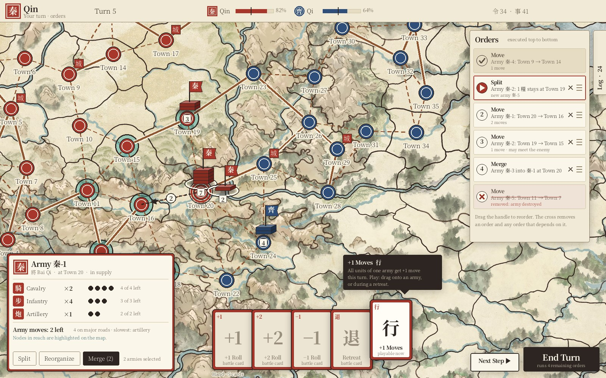

# Cabinet Wars Game Screen: Layout and Interaction

**Status:** implemented in `packages/client` (see [section 12](#12-engine-and-code-changes) for where each part lives and how the build differs from this proposal).

This document specifies the in-game screen:
- where everything sits on screen
- how players give orders and step through them
- how armies, cards, battles and the log are presented

It complements the [design system](design-system.md), which defines colors, fonts and other theme tokens. The game rules are in the [README](../Readme.md). The mockups below use the canonical Imperial China theme.



*Mockup of the game screen, not a screenshot:*
- *Top bar: the acting player's emblem and turn, and each nation's willingness.*
- *Map: army pieces on the nodes (the mockup predates the Kriegsspiel pieces). Two armies at Town 20 are selected, their node has a red "here" ring, and the nodes they can reach are highlighted.*
- *Bottom left: the army card. Bottom centre: the hand, with a tooltip on "+1 Moves".*
- *Right side: the orders list, with the collapsed log tab at the edge. Bottom right: Next Step and End Turn.*

## Contents

1. [Screen layout](#1-screen-layout)
2. [Nation emblems](#2-nation-emblems)
3. [Cards in hand](#3-cards-in-hand)
4. [Armies on the map](#4-armies-on-the-map)
5. [The army card](#5-the-army-card)
6. [Orders and steps](#6-orders-and-steps)
7. [End Turn and Next Step](#7-end-turn-and-next-step)
8. [The battle panel](#8-the-battle-panel)
9. [Fog of war](#9-fog-of-war)
10. [The log](#10-the-log)
11. [Online play, help and sound](#11-online-play-help-and-sound)
12. [Engine and code changes](#12-engine-and-code-changes)
13. [Open questions](#13-open-questions)

---

## 1. Screen layout

The map fills the whole window below the top bar. Every other element floats over it, so as much map as possible stays visible.

| Region | Position | Contents | Visible |
|---|---|---|---|
| Top bar | Top, full width | Acting player's emblem, name and "your turn · orders" status; the player's own **collapse pill**; turn number; each nation's emblem with its willingness bar, threshold mark and willingness chip; deck counters | Always |
| Map | Full window under the top bar | Background art, roads, nodes, army pieces, highlights, planned-order arrows, the supply overlay | Always |
| Army card | Bottom left | Details and actions of the selected army or armies ([section 5](#5-the-army-card)) | When an army is selected |
| Hand | Bottom centre | The acting player's cards ([section 3](#3-cards-in-hand)) | Always during a player's own turn and in battles |
| Turn controls | Bottom right | **End Turn** (large) and **Next Step** (smaller, to its left) ([section 7](#7-end-turn-and-next-step)) | During the player's own turn |
| Orders | Right side, below the top bar | The step list ([section 6](#6-orders-and-steps)) | During the player's own turn; collapses to a header otherwise |
| Log | Right edge, as a vertical tab | Full history ([section 10](#10-the-log)) | Collapsed by default; expands over the orders panel |
| Battle panel | Docked at the bottom centre | The current battle ([section 8](#8-the-battle-panel)) | While a battle is running |
| Handoff screen | Full screen | "Pass the device to …" (hotseat only) | When the acting player changes in hotseat |
| Chat | Top left: a **Chat** button, opening a panel ([section 11](#11-online-play-help-and-sound)) | Messages, table notices, People list with Mute | Online games |
| Idle clock | Bottom right, above the turn controls | Time left for whoever the game waits for | Online games with a time to act |
| Since your last turn | Centred popup | What the player's side saw happen since their previous turn | At the start of the player's turn, when something happened |
| Connection banner | Top centre, over everything | "Connection lost — reconnecting…", or why the game ended | Online games, while not connected |
| Tutorial notes | Beside what they point at | The guided first game's notes | In the tutorial |

**How close each nation is to collapse.** Every nation's willingness bar shades the part below its threshold (the collapse zone) and ticks the threshold. Its chip shows the willingness percentage, coloured by how close the nation is to collapse: green with 25 or more points to spare, amber within 25 points, filled red within 10 points or once knocked out. The tooltip gives the numbers behind it (victory points held and owned, war exhaustion, threshold). Under the acting player's name, a pill of the same colour says it plainly: "Willingness 88% (collapse below 50%) · 38 points to spare". It pulses when the nation is within 10 points.

Clicking the nations, or that pill, opens the **War status** panel. It has one row per nation: victory points held out of owned (with how many are occupied), war exhaustion, the willingness bar, the collapse threshold and the distance to collapse. The player's own row is tinted and allies are marked. A line explains how willingness works. On phones each nation becomes a small card of labelled lines.

**Narrow windows (≤ 720 px).** The game is made for computers; phones are not a target. In narrow windows the top bar shrinks to the emblem, turn and a willingness summary. The army card and hand become a bottom sheet with two tabs ("Army" / "Hand"). The orders panel and the log become drawers opened from buttons in the top bar. End Turn and Next Step stay pinned bottom-right above the sheet.

---

## 2. Nation emblems

Every nation has an **emblem**: a small, unique badge used everywhere the game refers to that nation.
- the top bar (large, for the acting player)
- willingness bars and the lobby's seat list
- the emblem square on army pieces and the army card
- card backs and the corner of face-down cards
- order entries and log entries
- the battle panel's sides, wings and phase chips

Wherever the game names a nation, the emblem appears next to the name, so players can tell nations apart without relying on color alone.

### 2.1 Emblems provided by the map

A map can set an emblem per nation in `config.json`:

```json
{ "id": "qin", "name": "Qin", "color": "#a8362a", "side": "attacker",
  "emblem": { "glyph": "秦", "shape": "square" } }
```

or an image from the map folder:

```json
"emblem": { "image": "emblems/qin.png" }
```

`glyph` is 1–3 characters. `shape` is one of the shapes the current theme offers (see 2.3). `image` must be a square PNG/SVG in the map folder; it's included in `.cabinetwars` bundles.

### 2.2 Auto-generated emblems

When a nation has no emblem, the client generates one. The result is **deterministic**: it depends only on the map's nations, so every player, host and replay sees the same emblems.

1. **Glyph.**
   - If the nation's name contains a CJK character, use the first one (e.g. "秦国" → 秦).
   - Otherwise take the name's first *n* letters, starting with *n* = 1 and growing up to 3, and stop at the first *n* where they differ from the first *n* letters of every other nation's name. If the name runs out of letters first, use the whole name. The first letter is capitalized.
     - "Prussia" and "Poland" share "P" but differ at "Pr" / "Po", so they get **Pr** and **Po**.
     - "Qin" and "Qi" share "Q" and "Qi"; "Qi" runs out of letters and keeps **Qi**, while "Qin" becomes **Qin**.
   - If two glyphs are still identical after 3 letters (e.g. "Austria" and "Austrasia"), use the first letter plus a number in config order: **A1**, **A2**.
2. **Shape.** Pick a shape from the theme's `emblem.shapes` list, indexed by a stable hash (FNV-1a) of the nation id.
3. **Style.** Pick one of the theme's `emblem.styles` from the next bits of the same hash. In the Imperial theme these are the two classic seal styles: **白文** (colored field, paper glyph) and **朱文** (paper field, colored glyph and border).
4. **Color.** The nation's map color.
5. **Uniqueness.** Go through the nations in config order. If an emblem has the same glyph, shape and style as an earlier one, move to the next shape, then the next style, until it's unique.

Emblems are drawn as SVG (shape path, border, glyph in `type.family.display`) and cached as a texture for the map and as an inline image for the interface.

### 2.3 Theme tokens

| Token | Meaning | Imperial China |
|---|---|---|
| `emblem.shapes` | Shapes available to maps and auto-generation | `["square", "round", "gourd", "tablet"]` (seal shapes) |
| `emblem.styles` | Styles available to auto-generation | `["field", "outline"]` (白文 / 朱文) |
| `emblem.font` | Font stack for glyphs | `type.family.display` |
| `emblem.border` | Border width, as a fraction of size | `0.06` |
| `emblem.wear` | Optional "worn stamp" texture asset | `ornament/seal-wear.png` |

A European theme would offer `["heater-shield", "roundel", "banner", "lozenge"]`.

---

## 3. Cards in hand

### 3.1 Look

The hand is a slightly fanned row of real-looking cards at the bottom centre.

- **Shape.** Portrait cards with a 2:3 ratio (about 112 × 160 px on desktop, at least 72 × 108 on phones), rounded 8 px corners and a soft drop shadow.
- **Frame color = the acting player's nation color.** In hotseat the whole hand re-colors when the device passes to another nation, which reinforces whose hand it is.
- **Face.** A paper panel inside the frame, with the card's **symbol** large in the centre, the symbol again as a small **corner index** (top left, in the nation color), the card **name** underneath, and a one-line **playability hint** ("battle card", "playable now").
- **Back.** Face-down cards (the opponent's committed battle cards, and the deck counters) show the nation color with the theme's card-back motif and the owner's emblem.

### 3.2 Symbols

| Card | Symbol | Meaning of the symbol |
|---|---|---|
| +1 Roll | **+1** | Adds to a die |
| +2 Roll | **+2** | Adds to a die |
| −1 Roll | **−1** | Subtracts from a die |
| Retreat | curved back arrow | Leave the battle |
| Block Retreat | shield with a bar | Cancel a Retreat |
| +1 Moves | double chevron | Extra movement |

Symbols come from the theme (`icons.card.*`) and are language-neutral pictograms or numbers; the name underneath is translated text, so no symbol has to be learned.

### 3.3 States

| State | Look | When |
|---|---|---|
| Playable now | Full color | e.g. +1 Moves during your orders, battle cards during a battle's commit step |
| Not playable now | Face washed out; frame keeps its color | e.g. battle cards outside a battle |
| Hovered / focused | Lifted 24 px, larger shadow, tooltip shown | Pointer over the card, or keyboard focus |
| Selected | Lifted and outlined in `color.focus` | Clicked, waiting for a target (an army or a die) |
| Committed | Leaves the hand; shown as a badge on its die, face down to the enemy until both sides are done | After it is played in a battle |

### 3.4 Tooltip

Hovering over a card (after 300 ms), focusing it with the keyboard, or long-pressing it on touch shows a tooltip above it with:

1. **Name**, e.g. "+1 Moves".
2. **Effect** in one sentence: "All units of one army get +1 move this turn."
3. **When and how to play it**: "Drag onto one of your armies, or play it during a retreat." For a card that isn't playable now, this line says when it will be: "Playable in battle, at the commit step."

The tooltip uses the theme's inverse surface (ink background, paper text in Imperial China) so it stands out from the paper interface.

### 3.5 Playing a card

- **Drag and drop:** drag +1 Moves onto an army piece or the army card; battle cards are played from the battle panel (click a card, then a die).
- **Click alternative** (and for keyboard and touch): click the card to select it; valid targets light up; click a target. Escape cancels.
- **+1 Moves** played outside a battle becomes an **order** in the step list (it takes effect when executed), so it can be reordered like any other order.

---

## 4. Armies on the map

### 4.1 Kriegsspiel pieces

Armies are drawn as **Kriegsspiel pieces**, after the red and blue blocks of Reisswitz's 1824 war game, which was played on a paper map like this one. Each piece stands at the **upper right of its node**, so the town circle, its name (below) and its victory-point badge (upper left) stay visible and clickable:

- a dark **header** with the nation's emblem glyph on a square of its color, the army's **total of combat units** in large figures (supply units don't fight, so they are not counted), and a **gold star per general** (at most three drawn);
- below it, **one block per unit type** the army holds, in the nation's color, in two columns: the type's military map symbol (a cross for infantry, a diagonal for cavalry, a dot for artillery, a low bar for supply) and how many units of that type the army has;
- a **drop shadow**, so the piece sits on the painting;
- a red **"!" badge** at the header's right when one of the player's own (or allied) armies is **out of supply**, i.e. it will lose a unit at the end of its turn. Ghosts of planned positions get the badge too when the planned move ends out of supply.

The pieces are drawn with Pixi graphics in `render/MapView.ts` (`drawPiece`), so every theme gets them with no art; a theme only sets their shadow (`army.shadow`) and the ghosts' opacity (`army.ghostAlpha`). An army that changes node slides there along a straight line.

The **theme gallery** (main menu → Settings → "Theme gallery…") shows the unit blocks and their symbols in any nation color, sample armies of several sizes on a map, and the theme's nation colors, emblems, icons, interface colors and type.

**Map scale.** A map's `mapScale` (set in the editor) draws the background that many times bigger while nodes, roads, labels and pieces keep their size. The map view keeps node positions in image pixels and scales them when drawing, so clicks, focus points and the editor all keep working in image pixels.

### 4.2 Several armies on one node

Several armies on one node stand side by side, the first at the node's upper right and the others to its right. A planned position (ghost) takes its place in the same row. Allied armies can't share a node (see the rules), so a node only ever holds armies of one nation.

### 4.3 Interaction

| Action | Result |
|---|---|
| Hover a piece | It lifts slightly and brightens |
| Click own army | Selects it: a selection frame around the piece, red **"here" ring** on its node, reachable nodes highlighted, army card opens. Reachable nodes where the army would end the turn **out of supply** also get a red ring and the "!" badge (`suppliedAt` in the engine; supply units travelling with the army count only if they are supplied there themselves) |
| Shift/Ctrl + click, or drag a box | Adds armies to the selection (needed for Merge) |
| Click an enemy army | Selects it read-only: the army card shows what is known about it; no highlights, no actions |
| Click a highlighted node | Adds a **Move** order for the selected army (see [section 6](#6-orders-and-steps)) |
| Right-click a node | Same as clicking a highlighted node: moves the selected armies there An out-of-reach node shows a message. The browser's context menu never opens on the map |
| Click empty map or press Escape | Clears the selection |

### 4.4 Planned positions

After an order is added, the map shows the **planned** result:
- a translucent **ghost piece** at the destination
- a **dotted ink arrow** along the path, with a numbered disc showing the order's step number

The real piece stays where it is until the order is executed, and then moves along the path.

---

## 5. The army card

A card in the bottom-left corner appears when an army is selected. Its frame uses the army's nation color, like the hand's cards.

### 5.1 Contents

1. **Header:** nation emblem, army name, generals (★ Bai Qi), current node and "in supply" (in `state.success`). An army **out of supply** instead gets an alert box under the header, with the same "!" badge as the map: "Out of supply: loses one unit at the end of the turn", plus how supply reaches. When some highlighted destinations would cut the army off, a line explains the "!" marks on the map.
2. **Units, one row per type:** type icon (horse, soldier, cannon, grain sack), type name, count (×4), and **movement pips**, one dot per point of movement that unit type has: filled ● for moves still available this turn, hollow ○ for moves used. Each unit type shows its own pips, so the player can see who is holding the army back. For example:
   - Cavalry ●●●○ (3 of 4 left)
   - Supply ○ (0 of 1 left) → the army can't move until the supply is split off.
3. **Army movement summary:** "Army moves: 2 left (6 on major roads) · slowest: artillery". If a split would free faster units, the card suggests it: "Split off the 糧 supply to move 2 more."
4. **Actions** (buttons along the bottom):
   - **Split:** opens the split editor (5.3).
   - **Reorganize:** opens the reorganize editor (5.4). Only when the node holds more than one of your armies.
   - **Merge (n):** only when two or more of your armies are selected **and** they are on the same node. It merges all selected armies into the first one selected.
   - **Play +1 Moves:** only when a +1 Moves card is in hand; same as dragging the card here.

All numbers reflect the **planned** state, after the orders already in the list. The card says "after planned orders" when this differs from the army's actual position.

### 5.2 Map highlights

While the card is open:
- **The army's node** has a seal-red "here" ring (`map.highlight.here`).
- **Every node the army can still reach this turn** gets the move highlight, computed with the same rules the engine uses: slowest unit, the major-road doubling, stopping next to enemies, no entering nodes with other nations' armies.
- When **several armies** are selected, only nodes that all of them can reach are highlighted, and a move order moves them together (one order per army, grouped in the list).

### 5.3 Split editor

A small dialog above the card with two columns, **Stays** and **Leaves**:
- Units can be dragged between the columns, or moved with − / + counters per type.
- Generals are dragged the same way.
- It validates live: a column with combat units needs a general; neither column may be empty.
- Confirming adds a **Split** order. The new army gets a placeholder name ("秦-5 (planned)") until the order executes.

### 5.4 Reorganize editor

This is for redistributing units between armies on the same node in one step. It shows one column per army on the node, plus a "new army" column. Units and generals can be dragged between any columns, with the same checks as Split. Confirming adds a single **Reorganize** order; the engine executes it as one transfer ([section 12](#12-engine-and-code-changes)).

### 5.5 The node card

Clicking a town circle (rather than the army piece standing on it) opens a **node card** in the same corner, framed in the controller's color:

- **Owner** and **Control**, each with its nation emblem; occupied nodes say so, and name the owner.
- **Victory points**, and whether they currently count for the owner or are lost to the occupation.
- **Protected**: whether an army of the controller is within 2 nodes, so an enemy army ending its turn there would *not* take control.
- **Your supply**: whether the node is within reach of the viewing player's supply.
- **Muster** (own towns worth more than 5 VP): the nation's unit count against its cap ("Your units: 23 of 27"), and, during the player's orders, one button per unit type to raise a unit there. Otherwise a line says why not: already used this turn, at the cap, not the player's turn, or the town is occupied or has another army in it.
- **Roads**: one chip per connected node, drawn solid for major and dashed for minor roads; clicking a chip moves to that node's card.
- **Armies here**: every army the player can see on the node; clicking one opens its army card.

Inside a town circle the node always wins the click; the army piece above it selects the army. With an army selected, clicking a highlighted node still plans a move there. Clicking a log entry with a location also opens that node's card. Escape or × closes it.

### 5.6 Recruiting

When a player draws a **Recruit** event (1 unit, 2 units, or a general), a banner opens at the top of the screen. Every town they own and control, with no other nation's army in it, is highlighted.

- For units, the player picks a type (cavalry, infantry, artillery, supply) in the banner. They then click a highlighted town, or choose one from the list.
- The recruit joins the player's army in that town, or forms a new army there. Recruit 2 Units asks twice, so the two units can go to different towns.
- The army card shows generals as their own row with movement dots (they ride at cavalry speed). Armies without a general show a warning while they stand in enemy territory, where they cannot move.

### 5.7 Mustering

Once per turn, during their orders, a player below their unit cap can raise one unit. The **Muster** button next to Next Step opens a banner at the top of the screen, and every town they can muster in is highlighted.

- The banner shows the unit count against the cap. The player picks a type (cavalry, infantry, artillery, supply), then clicks a highlighted town, or chooses one from the list.
- The unit joins the player's army in that town, or forms a new army there. The banner closes; Cancel or Escape closes it without mustering.
- The node card offers the same muster for the town it shows.

---

## 6. Orders and steps

During their turn a player doesn't act immediately: they **plan orders**, which go into the **Orders** list (the step list), and then **execute** them step by step.

### 6.1 Order types

| Order | Created by | Executes as |
|---|---|---|
| Move | Clicking a highlighted node with an army selected | `move` (one or more steps along a path) |
| Split | Split editor | `split` |
| Merge | Merge button | `merge` (one per extra army) |
| Reorganize | Reorganize editor | `transfer` (new engine intent, see [section 12](#12-engine-and-code-changes)) |
| Play +1 Moves | Dragging the card onto an army | `playMoves` |

### 6.2 Planning

- **Projection.** The client keeps a **projected state**: a copy of the player's current view with every planned order applied in list order. It uses the engine's own functions (`moveArmy`, `splitArmy`, `mergeArmies`, `reachable` in `packages/engine`), so planning follows exactly the same rules as execution.
- **What it drives.** The army card's numbers, the reachable-node highlights and the ghost pieces all come from this projection.
- **Placeholder armies.** Orders can refer to armies that only exist after an earlier planned Split. These use **placeholder ids** that are replaced by the real ids when the split executes.
- **Adding orders.** New orders can be added **as long as some army still has a valid action** in the projected state (moves left, or something to split, merge or reorganize). Otherwise the list shows "No more orders possible. Press End Turn."

### 6.3 The list

Each entry shows:
- a status disc (step number, ▶ for the next step, ✓ done, ✕ removed)
- the order type and a one-line description ("Army 秦-1: Town 20 → Town 16")
- a detail line ("2 moves · may meet the enemy")
- a drag handle and a remove button

| Status | Look | Meaning |
|---|---|---|
| Next | Paper, cinnabar border, ▶ | Runs when Next Step is pressed |
| Planned | Paper, number | Waiting |
| Running | Next, with a progress indicator | Being executed (the army is moving, or a battle is open) |
| Done | Toned paper, ✓, muted text | Executed; it disappears into the log at the end of the turn |
| Removed | Pale red, ✕, struck through, with the reason | Could not be executed ("army destroyed in battle"). Stays in the list for the rest of the turn; its × button clears it |

**Reordering.** Planned orders can be dragged to a new position. The list checks **dependencies** while dragging:
- an order can't move above an order it depends on (e.g. moving the army created by a split above that split)
- a drop that would make the projection invalid shows a red insertion line and is refused

**Removing.** The ✕ on an order removes it **and every order that depends on it**, after a confirmation that lists them.

**Running orders.** Done and running orders are fixed; only planned orders can move.

### 6.4 Execution

Pressing **Next Step** executes the top planned order:

1. The client sends the order's engine intent(s) to the host (or the local engine in hotseat), and the map animates the result.
2. If the order triggers a **battle**, the order stays "running" and the [battle panel](#8-the-battle-panel) opens. Next Step is disabled until the battle ends.
3. The client **re-projects** the remaining planned orders from the new real state. Any order that is no longer possible is marked **Removed** with a reason, together with every order that depends on it. Examples:
   - the army was destroyed or retreated in a battle
   - a move was stopped early by a previously hidden enemy (the engine truncates such moves), so the rest of that army's path is gone
   - a merge partner no longer exists
4. The next valid order becomes **Next**.

When no planned orders remain, **Next Step is disabled**. The player can still add orders if some army has a valid action left, which re-enables it.

### 6.5 Privacy, online play and saves

- Planned orders are **private and local** to the player's browser. Opponents and the server only ever see executed intents, so the fog of war is unchanged.
- Only executed intents go into the game's transaction log and save files, exactly as today.
- The current plan is kept in browser storage, so a reload or reconnect during a turn restores it.

---

## 7. End Turn and Next Step

Both buttons sit in the **bottom-right corner**: End Turn is large, and Next Step is smaller, to its left.

| Button | Enabled when | Label detail | Action |
|---|---|---|---|
| **Muster** | It's your turn, during your orders, below your unit cap, with a free town to muster in, and not yet used this turn | Its tooltip says why it's disabled | Opens the muster banner ([5.7](#57-mustering)) |
| **Next Step ▶** | It's your turn, a planned order exists, and nothing is running (no battle, no host reply pending) | — | Executes the next order ([6.4](#64-execution)) |
| **End Turn** | It's your turn and nothing is running | "runs 4 remaining orders" when orders remain | Executes all remaining planned orders in order, then ends the turn |

End Turn behaves like pressing Next Step repeatedly:
- It **stops for battles**: the battle panel opens, and afterwards the recap asks what to do next. **Continue** runs the remaining orders and ends the turn. **Stop here** leaves the remaining orders planned, so the player can give new orders, go step by step with Next Step, or press End Turn again.
- **Instant battles** are shown too, in the same recap. These are battles decided without any rolls, such as an army without combat units running into the enemy. The orders list warns about them in advance ("meets the enemy with no combat units: it will be destroyed").
- It **skips orders that become invalid** (shown as Removed).
- It sends `endTurn` once the list is empty.

While it runs, the button shows progress ("Running 2 of 4 …"). Pressing Escape stops the run after the current order, leaving the rest planned. When the list is already empty, End Turn simply ends the turn.

Keyboard: **N** runs the next step, **L** opens or closes the log, **M** minimizes or restores a popup, and **Escape** closes an editor, deselects, or stops a running End Turn.

---

## 8. The battle panel

A battle opens a **compact panel docked at the bottom of the screen**. There is no dimming, so the fight stays visible on the map. The map pans to the battle so the two armies sit above the panel. The panel opens for both players: the attacker when their order triggers it, and the defender whenever it starts (in online games the defender's screen opens it immediately; in hotseat after the handoff screen). The hand is hidden during a battle, because its cards are played from the panel.

### 8.1 Structure

1. **Wings:** a narrow column on each side of the panel, attacker on the left and defender on the right, tinted in the nation's color. Each wing shows how many units that side has lost in this battle, with a struck-through token for each one.
2. **Title:** crossed-swords icon, "Battle at Town 25" and the round number.
3. **Sides and phases:** each nation's emblem and name, whether it attacks or defends, and its combat units left. Between them are the three phases of a round, following the rules in the README: **1 Units drawn** → **2 Stand or retreat** → **3 Dice**. The current phase is filled in.
4. **Matchups:** one row per attacking unit, showing that unit, its die, "vs" (or the totals once the dice are rolled), the die of the defending unit it faces, and that unit. A "+1" chip marks a unit-type bonus. When several attacking units face the same unit, its rows say "same unit". Dice are empty and dashed until the roll.
5. **Status:** a chip per side, e.g. "deciding…" or "has decided" at the retreat step, and "placing cards…" or "1 card played" after the roll. The other side's choice and cards stay hidden until both are done.
6. **Actions**, only on the acting player's screen:
   - **Stand or retreat:** **Fight**, **Block Retreat**, **Retreat** and **Panic retreat**. The card buttons show how many of that card the player holds, and are disabled without one.
   - **Dice:** the player's roll cards. Click a card, then any die: your own for +1 or +2, the enemy's for −1. A placed card shows as a badge on the die, and the row totals update. Click the badge to take the card back. **Play N cards** (or **No cards**) confirms. Only players holding roll cards are asked.
7. **Round result:** once a round is resolved, the panel shows its outcome and keeps it on screen until the player clicks **Next round**, even if the next round has already begun. It shows both sides' choices, then each duel with its dice, card badges, totals, a struck-through token for the unit that fell, and the winner's emblem. An expandable battle log sits at the bottom.
8. **Minimize:** a "–" button collapses the panel to a pill at the top of the screen ("Battle at Town 25 · your move"). Clicking the pill, or pressing **M**, brings it back. Every popup works this way, including the battle recap, attrition, Sabotage and game-over dialogs.

### 8.2 Retreat

When a retreat takes effect, the panel **shrinks to a banner** at the top of the screen. The destination is not chosen by the player: the army always falls back exactly 2 nodes, to the node farthest from the enemy (see the README's retreat rules). The banner names that node, which is highlighted in the retreat color, and says how many members get away. If some members are too slow and the player holds a +1 Moves card, the banner offers **Play +1 Moves** next to **Retreat now**. Otherwise the retreat happens at once; an army with no route out is destroyed.

### 8.3 Who sees what

- **Fighting players** get the full panel.
- **Onlookers** get a small banner at the top instead: "Battle at Town 25 · Qin (2 lost) vs Qi". Onlookers are players whose side can see the battle but who are not fighting it, including allies. They never see the drawn units, choices, dice or cards.
- **Battles in the fog of war** are not shown at all (see the README).

### 8.4 Closing

Nothing closes by itself. When the battle ends:

1. **Fighting players** first see the panel in its final state: "Battle over", the last round, and each side's total losses in the wings. They close it with **Close**.
2. **Everyone who could see the battle** then gets the **Battle over** popup, which holds only the core information:
   - a one-line outcome, e.g. "Qi wins. The army of Qin retreated.";
   - one card per side, the attacker on the left and the defender on the right, in the nation's color. Each card shows the role, a status (**Victory**, **Retreated**, **Destroyed**, or **Held its ground**), the **Troops** the army brought (counts by unit type), and the troops it **Lost**. The winner's card is outlined in its color.

   **Continue** closes it. If several battles ended, their popups follow one another ("Continue (2 more battles)"). Afterwards the orders list marks any orders the battle made impossible as Removed.

---

## 9. Fog of war

The map shows each player's fog of war directly. Every node owns its Voronoi area of the map, meaning the part of the map closer to it than to any other node. Areas of nodes the player cannot see get a soft wash with diagonal hatching (`map.fog.*` tokens).
- The map, roads and nodes stay visible underneath, with fogged nodes dimmed, so players still know the geography.
- Enemy armies in fogged areas are not shown.
- A fogged node's card says so ("Under fog of war: you cannot see armies here.").
- In hotseat the fog follows the player at the screen; after the game ends the fog lifts.

## 10. The log

The log is its own **drawer on the right edge**:

- **Collapsed (default):** a vertical tab on the right edge showing "Log · 24", the number of entries. A dot appears on the tab when something new happens while collapsed, such as an event card or the opponent's executed orders.
- **Expanded:** clicking the tab, or pressing **L**, slides the drawer open over the orders panel. It contains **every executed step of the game**:
  - grouped by turn, with the acting nation's emblem on each turn header
  - each executed order: move, split, merge, reorganize, cards played
  - drawn cards and events (with their effect)
  - control changes, attrition and knockouts
  - **battles as expandable entries**, showing each round's dice, cards, assignments and losses
- **Filters** at the top: All · My nation · Battles · Events.
- **Clicking an entry** pans the map to the node or army it concerns.
- The drawer only shows what the player is allowed to see: hidden enemy moves stay hidden, as today.
- Collapsing it again returns to the orders panel. The drawer starts collapsed at the beginning of every game.

---

## 11. Online play, help and sound

**Chat** (online games). The **Chat** button at the top left opens a panel of the table's messages, with a line to write in (Enter opens it, Escape closes it). Table notices (joined, left, took a nation, the game began, a nation was moved on for idling) are in italics. While the panel is closed, new messages show beside the button for a few seconds, with an unread count. **People** lists who is at the table, each with **Mute**: muting hides that player's messages in this browser only. The panel is not part of the screen's redraws, so a half-written message survives game updates.

**Idle clock** (online games). When the host set a time to act, a clock above the turn controls shows how long the player the game waits for has left: "Act within 4:32, or your turn ends" for the player's own nations, "Wei has 3:10 to act" for others. In the last minute it turns red, and the player gets one warning.

**Connection banner** (online games). If the connection to the server drops, a banner says so while the game reconnects by itself. If the game can't go on (the host ended it, the player was kicked, or opened the game in another tab), it says why, with a way back to the menu.

**Since your last turn.** At the start of the player's turn, after any battle recap, a popup lists what their side saw happen since their previous turn, grouped by nation turn: events, moves, battles (who fought, who won, losses — not each round's dice), control changes. Clicking a line closes it and shows that town. It can be turned off under Settings.

**Tooltips.** Resting the pointer on an element with an explanation shows it in a styled tooltip after a moment (at once on keyboard focus), kept inside the window. Every button's own description (`title`) shows the same way. Towns' owner, control, victory points, protection and supply, the army card's units, moves and supply, and the willingness pill have explanations of the rules behind them.

**Tutorial.** **How to play → Start the tutorial** starts a game on the smallest map, the player against the computer, with notes: each points at a part of the screen with a pulsing outline, and says what it is. Some wait for the player to do what they describe (answer the turn's first prompts or battle, select an army, plan a move, end the turn); the others have **Next**. **Leave the tutorial** ends the notes; the game goes on.

**Sound.** Short sounds, made in the browser: a tap when selecting an army, a tick for a town, a quill for a planned order, marching feet, drums and a horn when a battle begins, dice, paper for cards, a drum roll for recruits, a soft pop for chat, bells for the player's turn, a fanfare or a lament at the end. The volume is under Settings.

**Your turn.** When the game starts waiting for one of the player's nations, a bell rings; if the tab is in the background, its title blinks and (if allowed) a browser notification appears.

---

## 12. Engine and code changes

The rules engine barely changes; most of this is client work.

**As built**, compared with this proposal:
- Armies are Kriegsspiel pieces drawn with Pixi graphics (section 4.1), not sprites.
- Order planning lives in `packages/engine/src/orders.ts`: `projectOrders`, `orderToIntents`, and dependency helpers. The client's list and runner are in `packages/client/src/orders/plan.ts` and `ui/game.ts`.
- In the battle panel, roll cards are placed by selecting a card and then clicking a die. Drag-and-drop is used for playing +1 Moves onto armies.
- The parts of section 11 are in `packages/client/src/ui/`: `chat.ts` (chat, mute, connection banner), `turnClock.ts`, `summary.ts`, `tooltip.ts`, `tutorial.ts`, `alerts.ts` and `gameSounds.ts`, with the sounds in `audio/sound.ts`. Online games run on the server through `packages/table`, which the browser also uses for games on one computer (`net/local.ts`); `net/online.ts` is the browser's side of an online game.

**Engine (`packages/engine`)**
- `config.ts`: optional `emblem` on nations (`{ glyph?, shape?, image? }`). The engine ignores it but keeps it.
- New intent **`transfer`**: moves given units and generals between armies of the same nation on the same node, creating a new army when needed. It has the same general-requirement checks as `split`, and gives Reorganize a single log entry instead of a chain of splits and merges.
- Export a small **`project(view, orders)`** helper that applies planned orders to a copy of a view and reports the first invalid one. It's built from `moveArmy`, `splitArmy`, `mergeArmies` and the new `transfer`, so planning and execution share the same rules.
- Tests: projection validity, dependency detection, re-projection after a battle removes the right orders.

**Client (`packages/client`)**
- `ui/emblem.ts`: emblem resolution and generation (section 2), with an SVG renderer and a cache.
- `ui/hand.ts`: cards, tooltips, drag and drop (section 3).
- Army pieces, stacking, hover and selection, ghost pieces and order arrows (section 4) are in `render/MapView.ts`.
- `ui/armyCard.ts`, with the split and reorganize editors (section 5). Replaces the army section of `ui/game.ts`.
- `orders/planner.ts` (projection, placeholders, dependencies) and `ui/orders.ts` (the list, reordering, execution loop) (section 6).
- `ui/turnControls.ts` (section 7).
- `ui/battlePopup.ts`, replacing `ui/battle.ts` (section 8).
- `ui/logDrawer.ts` (section 9).
- The new theme tokens these components use are listed in the [design system](design-system.md#49-game-screen-components).

---

## 13. Open questions

- **Planning while waiting.** Should a player be able to plan orders during the opponent's turn, to be ready when theirs starts? That's easy with the projection, but it may reveal stale information.
- **Group moves.** Should moving several selected armies be one order or one per army? This document proposes one per army, grouped visually, so they can still be reordered individually.
- **Battle speed.** Should there be an "auto-resolve my side" option for players who don't want to assign dice manually (e.g. highest die against the weakest unit)?
- **Undo.** Executed orders can't be undone (they may have revealed information or rolled dice). Should the list make that more explicit, for example with a confirmation the first time a player presses Next Step?
