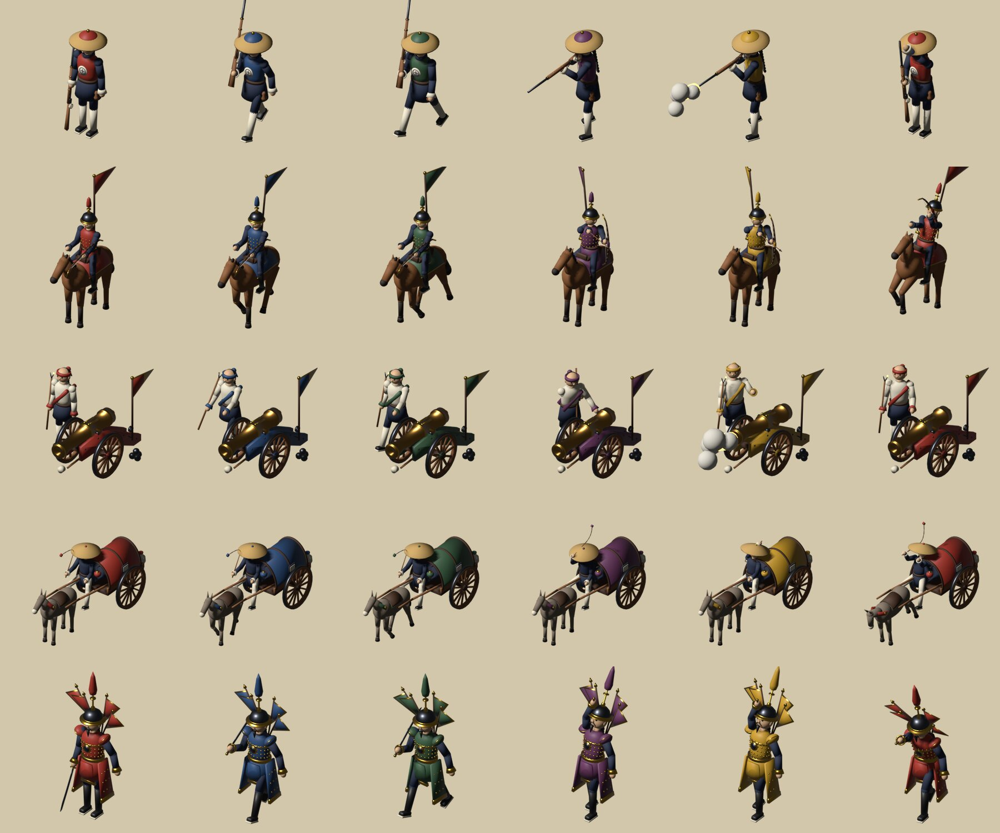

# Imperial China army miniatures

Animated 3D models for the Imperial China theme. They show the Qing army of about 1840–1860, and each unit type has its own look:

| File | Unit | What it shows |
|---|---|---|
| `infantry.glb` | Infantry | Green Standard musketeer: conical rattan hat with a tassel crown, a vest with the round "勇" badge, a queue, and a matchlock musket |
| `cavalry.glb` | Cavalry | Manchu bannerman horse archer: spiked helmet, studded coat, triangular Eight Banners flag on the back, and a composite bow |
| `artillery.glb` | Artillery | Bronze cannon on a lacquered carriage with a regimental pennant, served by a gunner with a linstock |
| `supply.glb` | Supply | Peking cart: vaulted cloth canopy, a lantern, rice sacks and a wine jar, pulled by a mule, with a driver in a bamboo hat |
| `general.glb` | General | Studded parade armour, a chest mirror plate, a tall plumed helmet, four opera-style back flags (kao qi) and a sabre (dao) |



## In the game

The theme's `army.model` token lists these files (see [docs/design-system.md](../../../docs/design-system.md#49-game-screen-components)). The client bakes them into sprite sheets per nation color and shows every army as a group of figures sized by its composition. The **Theme gallery** on the main menu shows them live.

## Nation color

Every part in the nation's color uses the single material **`Nation`**. The material also carries the glTF extra `"krieg_tint": "nation"`. To recolor a model, set that material's base color, for example in three.js:

```ts
gltf.scene.traverse((o) => {
  if (o.isMesh && o.material.name === "Nation") {
    o.material = o.material.clone();          // one copy per nation
    o.material.color.set(nation.color);
  }
});
```

The file's default is the theme's cinnabar red, `#a8362a`. The other materials are fixed: indigo cloth, linen, wood, bronze, gold, iron and so on.

## Animations

Each file has one skinned mesh, one armature and three looping clips at 24 fps:

| Clip | Length | Content |
|---|---|---|
| `Idle` | 2 s | Breathing and looking around. Horses and mules swish their tails and paw the ground; flags sway |
| `Walk` | 1 s | Walk in place: the game moves the model along the road. Wheels turn, horses walk a four-beat gait |
| `Combat` | 1.5 s | Infantry aims, fires and reloads. Cavalry draws, looses, then the horse rears. Gunner touches off the cannon, which recoils. Driver whips, mule bucks. General raises his sabre, points and slashes |

Muzzle flashes and smoke are parts scaled to 0 outside the moment of firing. The first and last frames of each clip match, so the clips can loop.

## Conventions

- Units are metres: a soldier is about 1.8 tall, the general about 2.0, the cart about 4 long. Scale each model to the plinth in the renderer.
- The origin is on the ground at the model's centre, and the model faces +Z, glTF forward (−Y in Blender).
- About 9k–19k triangles per model, with no textures.

## Rebuilding

The models are generated by [`tools/blender/build_army_models.py`](../../../tools/blender/build_army_models.py). Edit the script rather than the `.glb` files, then run:

```sh
blender -b --factory-startup --python tools/blender/build_army_models.py
# optional: only some models, and preview renders
blender -b --factory-startup --python tools/blender/build_army_models.py -- themes/imperial-china/models cavalry --preview /tmp/preview
```

Requires Blender 4.4 or later; tested with 5.2.
