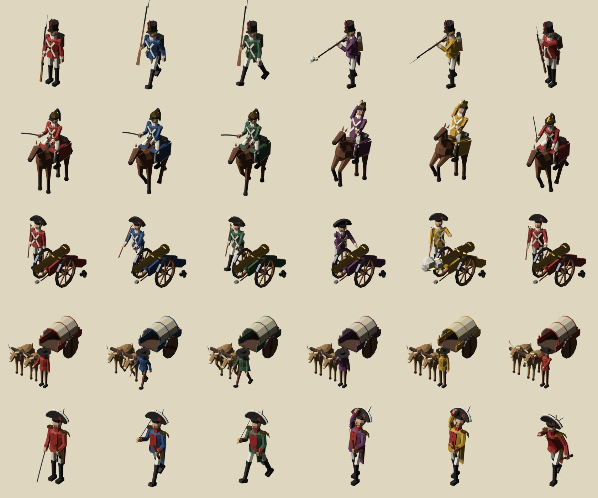

# Peninsular War army miniatures

Low-poly animated 3D models for the Peninsular War theme. They show the Spanish and Portuguese armies of about 1801–1808, and each unit type has its own look:

| File | Unit | What it shows |
|---|---|---|
| `infantry.glb` | Infantry | Line fusilier: stovepipe shako with a plume, white crossbelts, knapsack with a rolled blanket, and a musket with a fixed bayonet |
| `cavalry.glb` | Cavalry | Dragoon: crested brass helmet with a horsehair mane, shabraque with a white border, and a drawn sabre |
| `artillery.glb` | Artillery | Bronze field gun on a painted carriage with an ammunition chest, served by a gunner in a bicorne with a linstock |
| `supply.glb` | Supply | Iberian ox cart: solid wheels turning with the axle, a canvas tilt over a barrel and sacks, a yoke of oxen, and a carter walking at their head with a goad |
| `general.glb` | General | Plumed bicorne worn athwart, gold epaulettes, red facings, a sash, riding boots, a sabre and a telescope |



## In the game

The theme's `army.model` token lists these files (see [docs/design-system.md](../../../docs/design-system.md#49-game-screen-components)). The client bakes them into sprite sheets per nation color. The **Theme gallery** (main menu → Settings) shows them live.

## Nation color

The coat of every figure, the dragoon's shabraque, the gun carriage and the ox cart's bed are painted with the single material **`Nation`**, which also carries the glTF extra `"krieg_tint": "nation"`. The file's default is Spanish red, `#b8322a`. The other materials are fixed: white belts and breeches, black leather, brass, steel, wood, canvas and so on.

## Animations

Each file has one skinned mesh, one armature and three looping clips at 24 fps:

| Clip | Length | Content |
|---|---|---|
| `Idle` | 2 s | Breathing and looking around. Horses and oxen swish their tails and paw the ground. The general raises his telescope |
| `Walk` | 1 s | Walk in place: the game moves the model along the road. Wheels turn, horses and oxen walk a four-beat gait |
| `Combat` | 1.5 s | Infantry presents, fires, rams the next charge home, then charges with the bayonet. Dragoon raises the sabre, the horse rears, then he cuts. Gunner touches off the gun, which recoils. Carter goads the oxen, which toss their heads. General raises his sabre, points and slashes |

Muzzle flashes and smoke are parts scaled to 0 outside the moment of firing. The first and last frames of each clip match, so the clips can loop.

## Conventions

- Low poly: about 1.2k–2.8k triangles per model, flat shaded, no textures.
- Units are metres: a soldier is about 1.8 tall, the general about 2.0, the ox cart about 4.5 long. Scale each model to the plinth in the renderer.
- The origin is on the ground at the model's centre, and the model faces +Z, glTF forward (−Y in Blender).
- The bones have the same names as in the Imperial China set, so both share the walk and breathing cycles.

## Rebuilding

The models are generated by [`tools/blender/build_peninsular_models.py`](../../../tools/blender/build_peninsular_models.py), which reuses the rigging and export code of `build_army_models.py`. Edit the script rather than the `.glb` files, then run:

```sh
blender -b --factory-startup --python tools/blender/build_peninsular_models.py
# optional: only some models, and preview renders
blender -b --factory-startup --python tools/blender/build_peninsular_models.py -- themes/peninsular-war/models cavalry --preview /tmp/preview
```

Requires Blender 4.4 or later; tested with 5.2.
